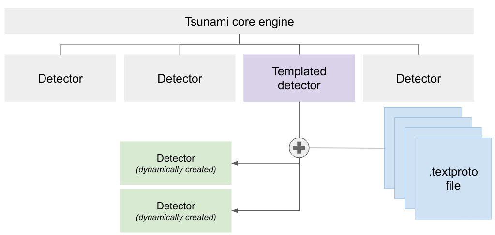

# Introduction

## What is a templated plugin?

In the past, if you wanted to write a Tsunami detector, you would need to
implement your detector using Java or Python. For each, you would have to write
a set of tests and ensure that everything is compiling and working as intended.

This process proved to be very time consuming; especially as most Tsunami
detectors are simply sending an HTTP request and checking the response code and
body content. That is why we introduced templated plugins.

## How does it work?

We have abstracted most of the code required to write a plugin. All you need to
do is to write a `.textproto` file that describes the behavior of your
plugin and a `_test.textproto` file that describes the tests for the plugin.

A `.textproto` is a human-readable text representation of a protocol buffer
message. If you are not familiar with protocol buffers, we recommend checking
the [official documentation](https://protobuf.dev/), but for our use case, you
can think of it as a strongly typed JSON or YAML.

The `.textproto` files are compiled into binary format and embedded as resources
to a meta plugin that we will refer to as the templated Tsunami plugin. At
runtime, the templated plugin will interpret the behavior described in each file
and dynamically create a new detector for it.

## How do I know how to write a templated plugin?

We have tried to cover as much as possible in this documentation. But the
configuration language is bound to evolve with time. If you have any doubt, the
source of truth will always be the
[proto definition](https://github.com/google/tsunami-security-scanner-plugins/tree/master/templated/templateddetector/proto)
which we aim at keeping as straightforward and commented as possible.

## Execution workflow of a templated plugin

Each plugin is defined by a set of two high-level concepts: **Actions** and
**workflows**.

- **Actions** are the basic unit of execution in a templated plugin. They are
responsible for performing one specific... well... action and returning a
boolean value that defines whether it was successful. An example action, in
plain English, could be:

> Send an HTTP request to the target and verify that the returned status code
> is 200

- Once you have defined a set of actions, you need to be able to define an order
in which they will be executed: this is the role of **workflows**.

To write a plugin, we need to define a set of actions and put them in a
specific order with workflows. But how are things executed? The engine processes
plugins in the following way:

1. Extracts all the workflows and actions defined in the plugin;
2. Performs very basic checks to ensure that everything is well defined;
3. Goes through all the defined workflows and execute the first that matches
the conditions it was defined with;
4. Executes every action of the workflow in order until one fails or all actions
are successful;
5. If any action failed, there is no vulnerability. If all actions were
successful, the vulnerability is present.

Steps 4 and 5 are repeated for every network service found during the port
scanning phase of Tsunami. We call steps 4 and 5 a **run of the workflow**.

## What is next

[Bootstrapping the plugin](02-bootstrapping)
